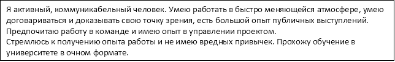

||
**Мильков Леонид**

+7 905 848 73 94

<kirtomj@mail.ru> 
|
| :- | :- |

Участник и призер акселераторов и хакатонов по ML, VR, разработке веб-сервисов, предпринимательской деятельности (20.35, ai challenge, хакатон по созданию навыков Яндекс Алисы, “Обучаюсь. Программирую. Проектирую. Будущее”);

` `Область навыков: backend, frontend, ML, data science, контейнеризация;

|Образование|||||
| :- | :- | :- | :- | :- |
|ВУЗ/ ССУЗ|||||
|2024|
**ЗГУ - Заполярный Государственный Университет**

Прикладная информатика
||||
|Ключевые навыки |||||
|Знание языков программирования|
Python, C#

||||
|Знание операционных систем|
Windows, Linux

||||
|
Языки

Знание баз данных

Знание библиотек для анализа данных

Статистические навыки

Машинное обучение

Визуализация данных
|
Русский — Родной

Английский — Технический

 

SQL, DB

Scikit-learn, NumPY, SciPy, Pandas, Matplotlib и т.п.

Статистическое моделирование, тестирование гипотез, вероятностное распределение

Линейная регрессия, логистическая регрессия, деревья решений

Создание графиков, визуализация, интерпретация и презентация 
||||

О себе

